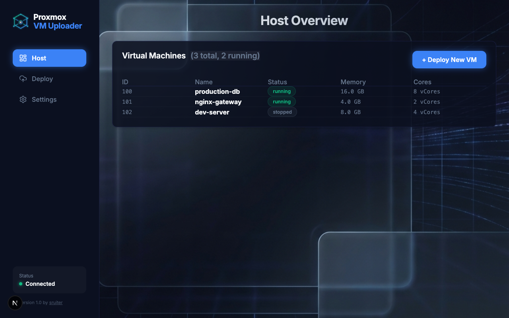
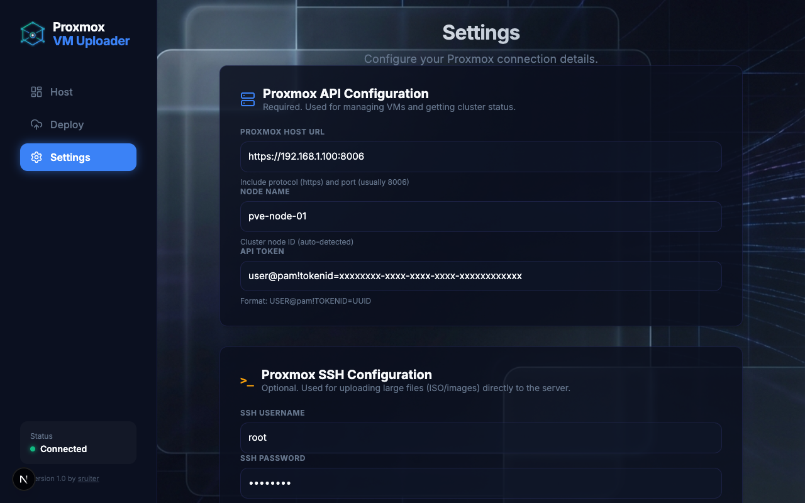

# Proxmox VM Uploader

A modern web interface for easily uploading disk images and deploying Virtual Machines to your Proxmox VE server.

## Screenshots

<div align="center">

### Host Overview


### Deploy VM


### Settings


</div>

## Docker Deployment

The recommended way to run this application is using Docker.

### 1. Prerequisites

- Docker and Docker Compose installed on your machine.
- Git (to clone the repository).
- Access to a Proxmox VE server (Host URL, Node name, API Token, and SSH credentials).

### 2. Installation

Clone the repository and enter the project directory:

```bash
git clone https://github.com/s-ruiter/proxmox-uploader.git
cd proxmox-uploader
```

### 3. Configuration

You need to create a configuration file to store your Proxmox credentials.

1. Create a file named `proxmox-config.json` in the project root:
   ```bash
   nano proxmox-config.json
   ```

2. Paste the following JSON structure and fill in your details:

   ```json
   {
     "host": "https://192.168.1.100:8006",
     "node": "pve",
     "token": "root@pam!tokenid=xxxxxxxx-xxxx-xxxx-xxxx-xxxxxxxxxxxx",
     "sshHost": "192.168.1.100",
     "sshUsername": "root",
     "sshPassword": "your-ssh-password"
   }
   ```
   > **Note**: The `sshHost` is usually the same IP as your Proxmox config host.

### 4. Run with Docker Compose

1. Create a `docker-compose.yml` file (if it doesn't exist already):

   ```yaml
   services:
     app:
       build: .
       ports:
         - "3000:3000"
       volumes:
         - ./proxmox-config.json:/app/proxmox-config.json
       restart: always
       container_name: proxmox-uploader
   ```

2. Start the container:

   ```bash
   docker compose up -d
   ```

The application will be available at [http://localhost:3000](http://localhost:3000).

---

### Alternative: Docker Run

If you prefer not to use Docker Compose, you can build and run the container manually:

```bash
# Build the image
docker build -t proxmox-uploader .

# Run the container (mounting the config file)
docker run -d \
  -p 3000:3000 \
  -v $(pwd)/proxmox-config.json:/app/proxmox-config.json \
  --name proxmox-uploader \
  proxmox-uploader
```
